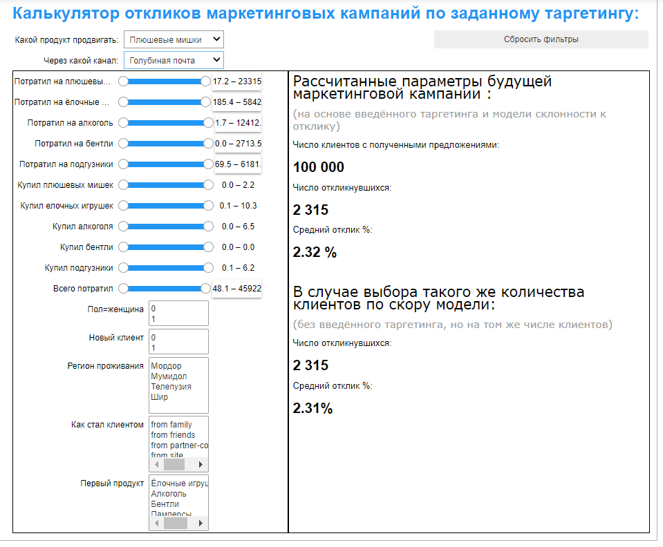
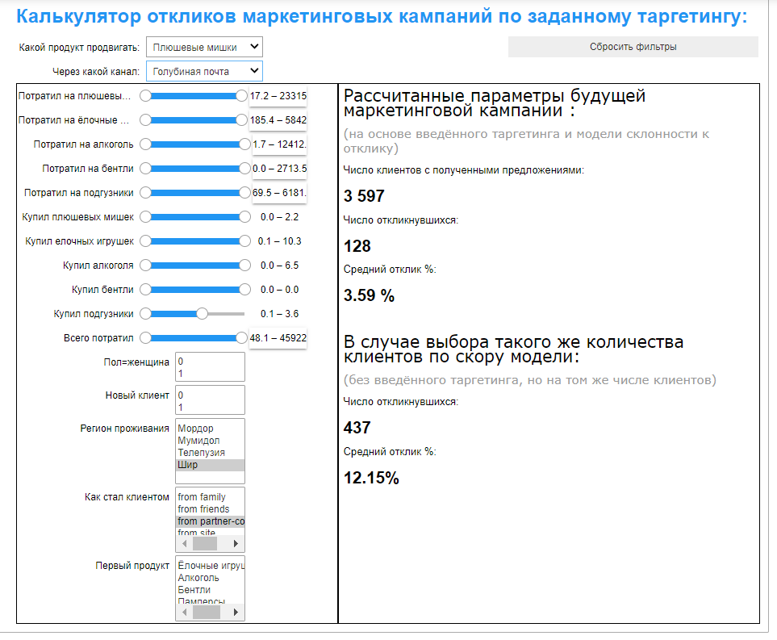

## Калькулятор откликов для маркетинговых кампаний с заданным таргетингом

Среди некоторых менеджеров целевых рекламных кампаний присутствует мнение, что весь эффект от ML-модели можно
повторить просто задав несколько параметров таргетинга клиентской аудитории. <br>

В данном прототипе можно интерактивно задать несколько параметров таргетинга рекламной кампании и сравнить 
эффект с эффектом, который был бы получен в результате коммуникаций с тем же количеством клиентов, отобранных
по наибольшему скору модели.

Минимальная жизнеспособная чаcть программы состоит из трёх файлов: useful_tool.py и двух файлов данных ("scored_client_base_part1.zip" и "scored_client_base_part2.zip"). Файлы данных должны быть в той же директории, что и useful_tool.py. 

Запуск происходит в Jupyter notebook (runner.ipynb) таким кодом:
```python
from useful_tool import useful_tool
useful_tool()
```

В начале интерфейс выглядит так:



Для каждого предлагаемого продукта и канала коммуникации с клиентом существует своя ML-модель. Продукт и канал возможной
коммуникации выбирает пользователь:


В данном случае мы предлагаем нашим клиентам купить у нас плюшевых мишек, отправив им письмо через голубиную почту (ведь это оригинальнее, чем отправить Push-уведомление).

При этом в начальном интерфейсе отклик по модели и отклик по таргетингу равны т.к. начальный таргетинг = отсутствие таргетинга

### Таргетинг на хоббитов
Если задать таргетинг на людей (или хоббитов) проживающих в Шире и ставших нашими клиентами через компанию-партнёра и 
покупающих в среднем мало подгузников, то получим такие результаты:


Таким образом, пользователь этого инструмента (менеджер по заведению целевых маркетинговых кампаний) может понять на каких группах его кампания будет или не будет работать или сравнить два разных таргетинга для целевой маркетинговой кампании и понять какой из них лучше, если по каким-то причинам он не хочет использовать прямой отбор по скору модели.
